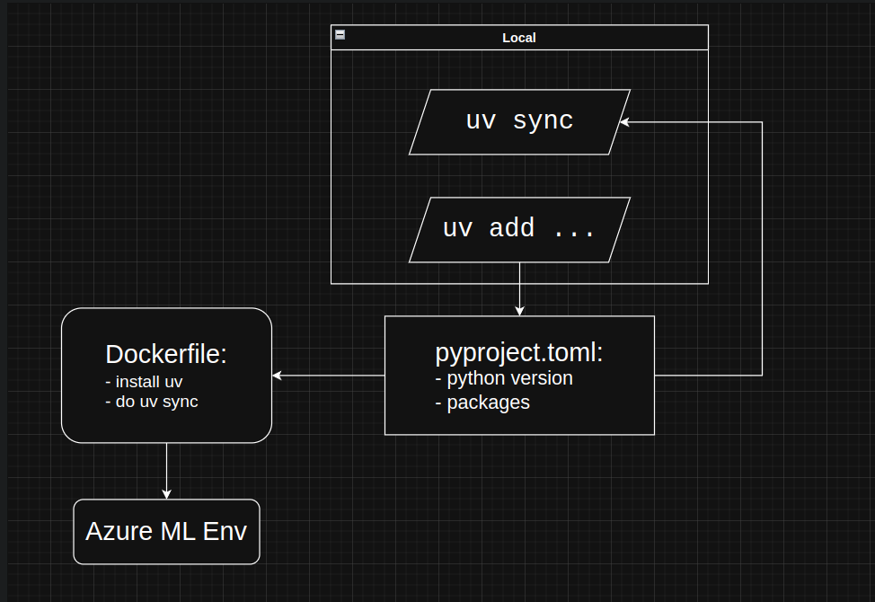

## Пролог
*Сквозь боль и страдание мы идём к светлому завтру. Или после-завтру, или ...*
## Что это
Шаблон для создание проектов AzureML Python SDK
Основные отличие от чистого шаблона:

- ДатаСхемы - некая схема для определение "формы" дата-сушностьи
- Авто-обработка АМЛ окружений(Для конда)
- Расслабленные линтеры
- Генерация мета-инфо файлика, для расспознание артифактов в блоб-сторедж(кастыль).

** UV + Docker:**
[UV](https://docs.astral.sh/uv/) - крутой пакет менеджер для питона, написанный на Расте. Из-за того что он написан не на питоне(в отличее от poetry), он не требует
чтобы изначально под него ставили питон. Просто ставим ЮВ, а он сам качает нужный питон(один раз) используя его бинарник как основу.
Шаблон поддерживает сборку локальной и облачной среды на основе [`pyproject.toml`](https://realpython.com/courses/packaging-with-pyproject-toml/) файла. Используя UV можно ставить зависимости как на локаль так и на облако.
ЮВ ставит бинарник питона версия которого указана в томл файлике, далее создаёт энв и устанавливает все зависимости из `pyproject.toml` файлика.

Обший флоу - как пример пандас:

1. добаввляем зависимости локально - `uv add pandas`. ЮВ устанавливает панду на локальный энв, и добавляет в зависимости(т в томл файлик)
2. врубаем пайп, на основе докер файла(который берёт уже измененной томл файлик) создаётся амл энв.

**Пример**:

Шаблон для наглядности содержит пример пайплайна, который состоит из трёх шагов-команд: препроцессинг датасета(свойства ноутбуков и ихние цены), тренировка модели(для предсказание цен) и предикта цен - используя выше тренированую модель.

## С чего начать

1. Смотрим на шаблон, прикидываем для себя - что именно нам нужно - команды, входы, выходы итд..
2. Удальяем примеры из папки `components/`, папку `.git/`, чишим `build_pipeline.py` и переименовываем папку под название вашего проекта.
3. Создаём питонское окружение, ставим зависимости с помошью poetry, или requirements.txt
4. Инициализируем гит, ставим pre-commit хуки: `pre-commit install`. Кстати, можно вручную запустить проверку пре-коммита - `pre-commit run`
5. Пишем свою логику.

## В Дополнение

- Не советую менять источник для компонент, `src/` вполне норм, + удобно для дальнейшей очистки мусора.
- Мы в основном используем конда-основные окружение, но также и возможно использовать докер. Для докера пока что авто механизма нету.
    Но вам не чего не мешает сделать всё по старинке.
- гибкость - шаблон не обязывет делать именно так - как в примере. Вы вполне можете использовать стандартный Инпут\Аутпуты самой СДК, орределять окружение как вам угодно.
    самое главное, не отключайте генерацию мета-инфо файлика и используйте линтеры.
- Шаблон далеко не идеален и открыт пулл-реквестам.

## Ссылки

[1] - https://learn.microsoft.com/en-us/azure/machine-learning/concept-data?view=azureml-api-2#data-types;

[2]-  https://stackoverflow.com/a/34102855/11570705;
